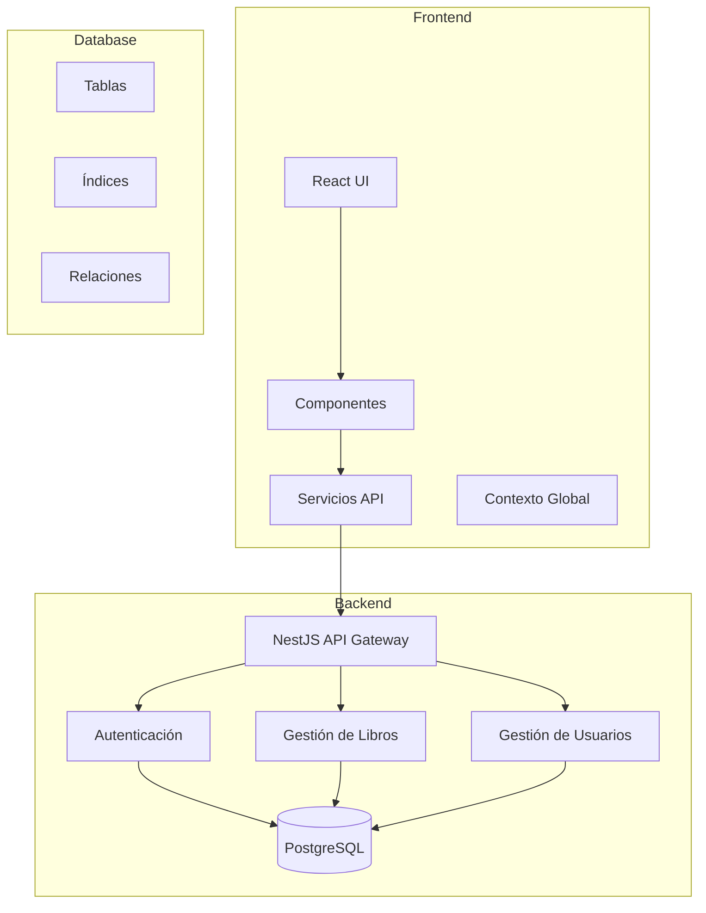
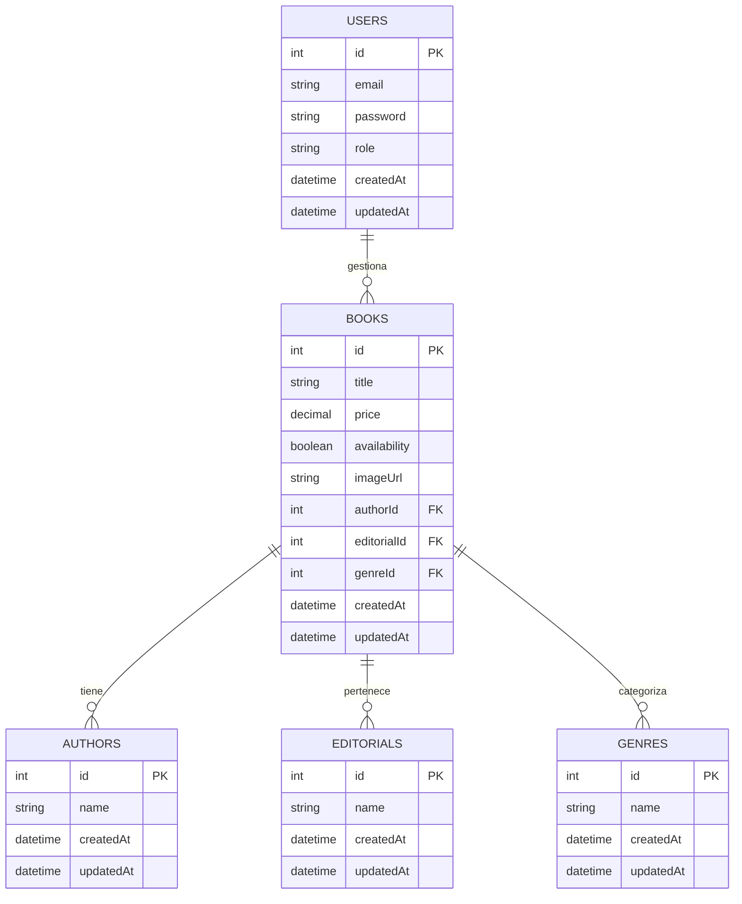
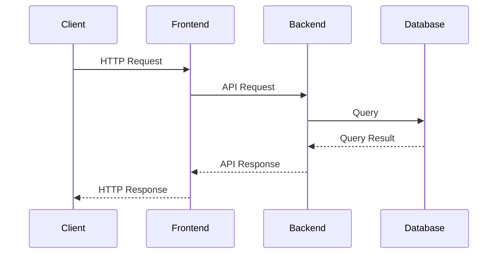

# Arquitectura del Sistema CMPC Libros

## Diagrama de Arquitectura

## Modelo de Datos

## Flujo de Datos

## Componentes Principales

### Frontend
- **React**: Framework principal para la interfaz de usuario
- **Context API**: Gestión del estado global
- **Axios**: Cliente HTTP para llamadas a la API
- **React Router**: Enrutamiento de la aplicación
- **Material-UI**: Componentes de interfaz de usuario

### Backend
- **NestJS**: Framework principal del backend
- **Sequelize**: ORM para la base de datos
- **JWT**: Autenticación y autorización
- **Swagger**: Documentación de la API
- **Class Validator**: Validación de datos

### Base de Datos
- **PostgreSQL**: Sistema de gestión de base de datos
- **Índices**: Optimización de consultas
- **Relaciones**: Integridad referencial
- **Transacciones**: Consistencia de datos

## Patrones de Diseño
- **MVC**: Separación de responsabilidades
- **Repository**: Abstracción de acceso a datos
- **DTO**: Transferencia de datos
- **Interceptor**: Procesamiento de peticiones/respuestas
- **Guard**: Protección de rutas 

## Decisiones de Diseño

### Tecnologías Principales
- **NestJS**: Elegido por su arquitectura modular, soporte TypeScript y patrones de diseño empresarial
- **React**: Seleccionado por su rendimiento, comunidad activa y ecosistema robusto
- **PostgreSQL**: Escogido por su robustez, soporte JSON y capacidades de búsqueda full-text

### Arquitectura
- **Arquitectura Modular**: Facilita el mantenimiento y la escalabilidad
- **API REST**: Estándar de la industria para comunicación cliente-servidor
- **Clean Architecture**: Separación clara de responsabilidades

## Seguridad

### Autenticación
- **JWT**: Implementación de tokens para autenticación stateless
- **Refresh Tokens**: Renovación automática de sesiones
- **Password Hashing**: Almacenamiento seguro de contraseñas

### Autorización
- **Roles**: Sistema de roles (admin, user)
- **Guards**: Protección de rutas basada en roles
- **Policies**: Reglas de negocio para acceso a recursos

### Medidas de Seguridad
- **CORS**: Configuración estricta de orígenes permitidos
- **Rate Limiting**: Protección contra ataques de fuerza bruta
- **Input Validation**: Validación estricta de datos de entrada

## Escalabilidad

### Estrategias de Escalado
- **Horizontal**: Adición de instancias de servidor
- **Vertical**: Optimización de recursos por instancia
- **Caché**: Implementación de Redis para datos frecuentes

### Optimización
- **Índices**: Optimización de consultas frecuentes
- **Paginación**: Manejo eficiente de grandes conjuntos de datos
- **Lazy Loading**: Carga bajo demanda de recursos

### Monitoreo
- **Logging**: Registro centralizado de eventos
- **Métricas**: Seguimiento de rendimiento
- **Alertas**: Notificaciones de problemas 