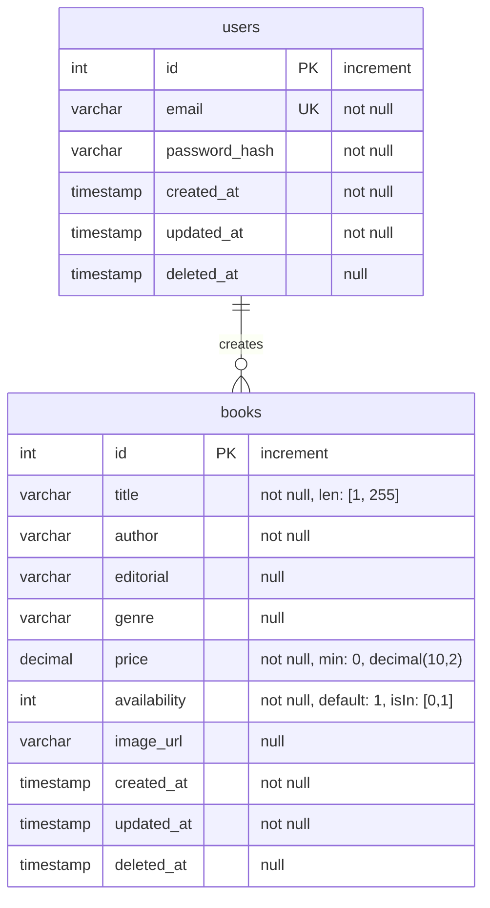

# Modelo Relacional de la Base de Datos

## Explicación del Modelo

### Tabla `users`
- **id**: Identificador único autoincremental
- **email**: Correo electrónico único del usuario
- **password_hash**: Contraseña hasheada
- **created_at**: Fecha de creación
- **updated_at**: Fecha de última actualización
- **deleted_at**: Fecha de eliminación (soft delete)

### Tabla `books`
- **id**: Identificador único autoincremental
- **title**: Título del libro (longitud entre 1 y 255 caracteres)
- **author**: Autor del libro
- **editorial**: Editorial (opcional)
- **genre**: Género (opcional)
- **price**: Precio con 2 decimales (mínimo 0)
- **availability**: Disponibilidad (0 o 1, por defecto 1)
- **image_url**: URL de la imagen (opcional)
- **created_at**: Fecha de creación
- **updated_at**: Fecha de última actualización
- **deleted_at**: Fecha de eliminación (soft delete)

### Índices
1. **users**:
   - Índice único en `email`

2. **books**:
   - Índice compuesto en `(title, author)`
   - Índice compuesto en `(genre, availability)`
   - Índice compuesto en `(editorial, price)`

## Notas de Implementación
- Todas las tablas implementan soft delete
- Los timestamps son manejados automáticamente
- Las validaciones de datos se realizan a nivel de aplicación
- Los índices están optimizados para las consultas más frecuentes 